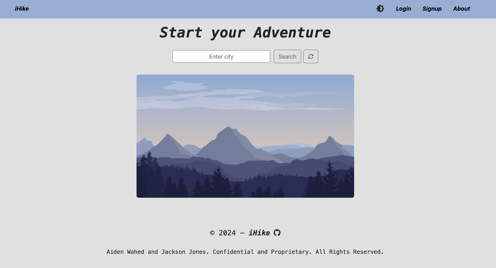
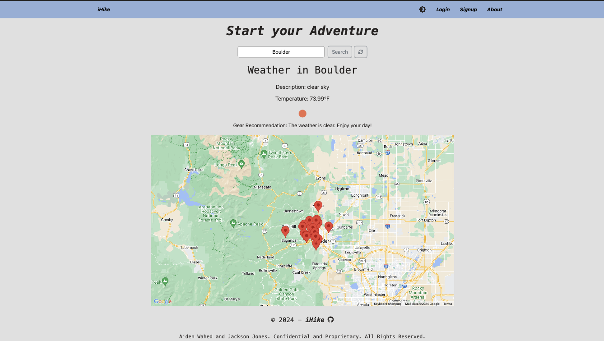
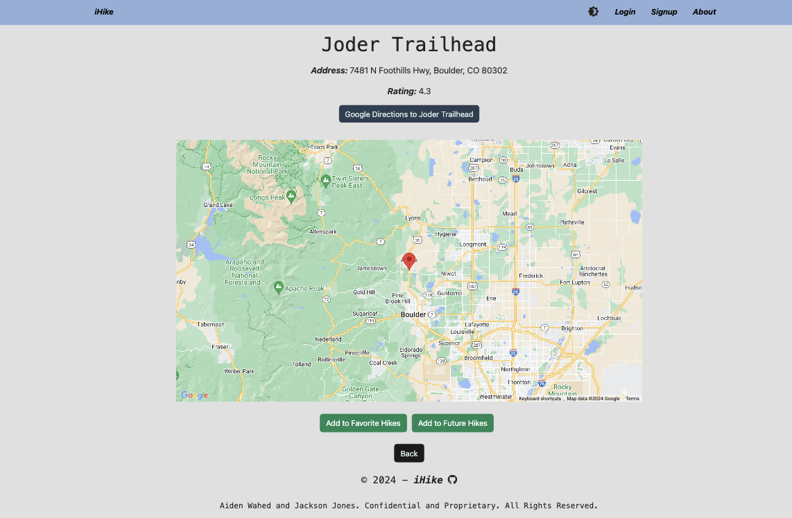

# I-Hike

## Table of Contents:

- [Overview](#Overview)
- [The Challenge](#The-Challenge)
- [Usage Information](#Usage-Information)
- [Application Info](#Application-Info)
- [Usage Instructions](#Usage-Instructions)
- [Installation Instructions](#Installation-Instructions)
- [Test Instructions](#Test-Instructions)
- [Built With](#Built-With)
- [What We Learned](#What-We-Learned)
- [License](#License)
- [Authors](#Authors)

# Overview

## The Challenge:

The challenge is to create a MERN stack single-page application that works with real-world data to solve a real-world challenge, with a focus on data and user demand.

## User Story

```md
As a existing user or new user,
I want to be able to login/create an account, so I can have full access to the I-Hike site.
I want to enter in a city in the search bar on the homepage, so I can get a map of nearby trails.
I want to click on the Marker in the map and view the trail, so I can then be redirected to the specific trail page displaying a map, trail info, and directions.
I want to have the ability to add the trail to my favorite or future hikes list, so I can view my hikes via the myHikes page with the ability to also remove said hikes.
```

## Acceptance Criteria

```md
- Use React for the front end.

- Use GraphQL with a Node.js and Express.js server.

- Use MongoDB and the Mongoose ODM for the database.

- Use queries and mutations for retrieving, adding, updating, and deleting data.

- Be deployed using Heroku (with data).

- Have a polished UI.

- Be responsive.

- Be interactive (i.e., accept and respond to user input).

- Include authentication (JWT).

- Protect sensitive API key information on the server.

- Have a clean repository that meets quality coding standards (file structure, naming conventions, best practices for class and id naming conventions, indentation, high-quality comments, etc.).

- Have a high-quality README (with unique name, description, technologies used, screenshot, and link to deployed application).
```

## Application Info:

```md
In a world where technology often keeps us indoors, iHike was created by two programmers with a passion to reconnect with nature and the great outdoors for everyone. We recognized a gap in the market for an all-encompassing hiking app that caters to all adventuring hikers, whether their skill level is beginner, intermediate, or seasoned adventurists.

Understandably, finding hiking trail information can be a daunting task, especially in unfamiliar land areas. This challenge often deters people from exploring new hikes and enjoying the physical and mental health benefits that come with spending time in nature. With iHike, we aim to make the discovery of new trails as simple and accessible as possible. By allowing users to input their city and instantly access a curated list of nearby hikes, complete with detailed descriptions, and difficulty levels, we provide a seamless solution.

iHike is more than just an app; it’s a gateway to adventure, health, and a deeper appreciation for the natural landscape around us. Our motivation is to empower people to explore the beauty around them, build connections with fellow hikers, and make every hike a memorable and enriching experience. Join us on this journey and let iHike be your guide to the great outdoors.

Your path to adventure starts here!
```

## Installation Instructions:

Step 1: Clone repository.
<br>
Step 2: Install Nodejs.
<br>
Step 3: Install a source-code editor like VsCode.
<br>
Step 4: Nodemon is recommended in order to refresh and see updated notes data.

## Usage Instructions

Step 1: Open VsCode(preferred) or another source-code editor if not already running.
<br>
Step 2: Open integrated terminal once in the main folder.
<br>
Step 3: run "npm i" / "sudo npm i" in the terminal to install the required dependencies.
<br>
Setp 4: Next are the seeders, run "npm run seed".
<br>
Step 5: Now to run the application, Enter "npm run build" and then "npm run start", or just "npm run develop" for development.
<br>
Step 6: After the "VITE v5.2.10 ready in 267 ms" appears in the console, open the local host URL that's displayed in the console if you haven't automatically directed to the application.

## Test Instructions:

For testing and debugging, the application logs requests and errors in the console. Unit testing not configured. For further debugging feel free to check the sources in Dev Tools for front-end and JavaScript Debug Terminal for backend.

## Solution URL:

[Solution URL Link to Live Application:]()

## Screenshots:



<br>



<br>



## Built With


- Google Maps API
- Open Weather Map API
- Dynamic JavaScript
- HTML
- CSS
- React
- GraphQL
- JWT
- Express
- Apollo Server
- MongoDB
- Dotenv
- Vite
- Bootstrap
- License Badge: [Shields.io](https://shields.io/)
- Visual Studio Code: [Website](https://code.visualstudio.com/)

## What We Learned

## License

Licensed under the The MIT License license.

[](https://opensource.org/licenses/MIT) (https://opensource.org/licenses/MIT)

## Authors

Aiden Wahed : [GitHub](https://github.com/prismhead26)
<br>

Jackson Jones : [GitHub](https://github.com/jacksonjjones)

© 2024 Aiden Wahed and Jackson Jones. Confidential and Proprietary. All Rights Reserved.
